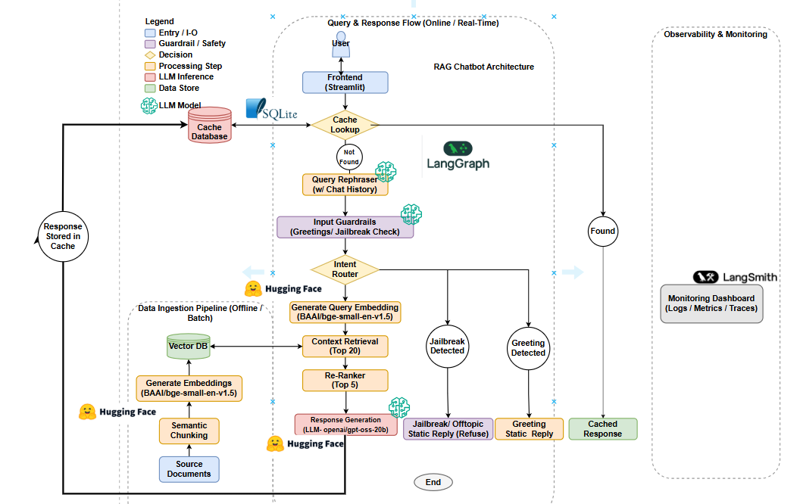

# RAG Chatbot with LangGraph, HuggingFace LLM, and Streamlit


This project implements a Retrieval-Augmented Generation (RAG) chatbot using **LangGraph** for workflow orchestration, a **HuggingFace LLM** as the core model, and **Streamlit** as a simple web UI. It includes:

- A modular RAG workflow built as a graph (`StateGraph`)
- Query rephrasing, input guardrails, and context retrieval
- Structured output via `PydanticOutputParser`
- A custom LLM cache to short‑circuit repeated questions
- A history‑teacher persona grounded in a Modern Indian History knowledge base

---

## Architecture
 

## Features

- **LangGraph‑based workflow**: Nodes for cache lookup, query rephrasing, guardrails, retrieval, and answer generation wired with conditional edges. [web:49][web:52]
- **Custom LLM wrapper**: Uses a HuggingFace model with temperature and HF token configuration.
- **RAG pipeline**: Retrieves context from your knowledge base (via `Retriever`) and generates grounded answers.
- **Input guardrails**: Routes user queries to:
  - RAG path (`rag`)
  - Capability message (`capability`)
  - Jailbreak block (`jailbreak`)
- **JSON‑structured answers**: Enforced via `PydanticOutputParser` and format instructions.
- **Caching**: Caches final answers per question so repeated queries are served instantly from cache.
- **Streamlit UI**: Simple chat‑style frontend to interact with the RAG bot.

---

## Configuration

### 1. Environment Variables

Create a `.env` file in the project root:

```env
HF_TOKEN=your_huggingface_token_here
LANGCHAIN_API_KEY= your_langsmith_api_key
```

And load it in Python:

```python
from dotenv import load_dotenv
load_dotenv()
```

### 2. `config.yaml`

Example structure:

```yaml
LLM_CONFIG:
  MODEL: "mistralai/Mixtral-8x7B-Instruct-v0.1"   # or any HF model you use
  TEMPERATURE: 0.2
```

Adjust according to your chosen HuggingFace model and parameters.

---

## Core Architecture

### Graph State

`GraphState` holds all data passed between nodes, including:

- `messages`: conversation history (LangChain `BaseMessage` list)
- `rephrased_query`: latest normalized question
- `guardrail_decision`: one of `rag`, `capability`, `jailbreak`
- `context`: retrieved knowledge base snippets
- `answer`: final answer returned to the user
- `cache_hit`: boolean flag indicating cache usage
- `cached_answer`: cached response when available

Defining these fields ensures LangGraph persists them across nodes. [web:49][web:52]

### Nodes

The graph is built from the following nodes:

- `cache_lookup`: Checks if the latest question is in the custom cache and sets `cache_hit` / `cached_answer`.
- `cached_answer`: Returns the cached answer and terminates the workflow on cache hits.
- `query_rephraser`: Rephrases the user question using `QUERY_REPHRASE_PROMPT` and `RephrasedQueryOutput`.
- `input_guardrails`: Uses `INPUT_GUARDRAIL_PROMPT` to classify the query (rag / capability / jailbreak).
- `capability_reply`: Explains the bot’s capabilities when a non‑RAG query is detected.
- `jailbreak_reply`: Blocks jailbreak / unsafe requests.
- `retrieve_context`: Fetches relevant documents from the knowledge base via `Retriever`.
- `generate_answer`: Runs the main RAG answer generation, parses JSON with `AnswerOutput`, and updates the cache.

### Routing Logic

Conditional edges orchestrate control flow:

- From `cache_lookup`:
  - `cache_hit` → `cached_answer` → `END`
  - `cache_miss` → `query_rephraser`
- From `input_guardrails`:
  - `rag` → `retrieve_context` → `generate_answer` → `END`
  - `capability` → `capability_reply` → `END`
  - `jailbreak` → `jailbreak_reply` → `END`

This ensures repeated questions bypass the full RAG pipeline and are served from cache. 

---

## HuggingFace LLM Integration

`HuggingFaceLLM` is responsible for:

- Initializing the HF model with token and configuration.
- Providing `.invoke(prompt)` that returns a message object with `.content` (string).
- Implementing `lookup_cache(question)` and `update_cache(question, answer)` to store and retrieve answers.
- Optionally exposing `.generate(prompt)` for raw text generation.

When used with `PydanticOutputParser`, the prompts enforce strict JSON output, which is then parsed into Pydantic models. [web:43][web:47]

---
